# Kalshi Weather Forecasting and Trading Research

**A comprehensive synthesis of the legacy experimentation archive and the next-gen research stack**  
Prepared from local repository artifacts on 2026-07-31

## Abstract

This paper summarizes the work completed so far in the Kalshi weather research repository across two phases: the archived `legacy-experimentation` system and the active `next-gen` system. The project studies whether point-in-time weather data, forecast ensembles, market prices, and offline model calibration can produce accurate probabilities for Kalshi daily high-temperature markets and, separately, whether those probabilities can support profitable paper trading strategies.

The central lesson is that the project has moved from a useful but tightly coupled prototype toward a more defensible research platform. The legacy system proved that point-in-time collection, forecast evaluation, HRRR short-range signals, and offline strategy simulation were all necessary. It also exposed major risks: small samples, data leakage concerns, overconfident bracket probabilities, unstable longshot trades, and strategy results that changed sharply under small policy adjustments. The next-gen system addresses those issues with immutable Supabase facts, frozen local exports, explicit quality reports, modular weather models, separate strategy evaluation, and a registry-backed workbench.

The best large-sample probability results currently come from Neuralcaster v2 market-blended models, meaning models that combine their own forecast with information already visible in Kalshi prices. The strongest large-sample run in the generated report index reached log loss 0.588, temperature MAE 0.865 F, and top-one bracket accuracy 75.1% across 2,012 bracket predictions. Neuralcaster v3 Huber-style residual models, meaning models trained to predict the leftover error after a simpler forecast, achieved stronger point-temperature MAE in some runs, as low as 0.819 F, but did not yet beat Neuralcaster v2 on bracket probability log loss. Strategy research remains less settled. Some early Cloudcaster and Neuralcaster EV backtests were positive, but negative controls and loose filters show that apparent profitability is highly sensitive to validation windows, execution constraints, and calibration. No report in this repository should be read as deployment authorization.

## Executive Summary

The research has learned five major things.

First, weather probability modeling and trading should stay separate. A model can be good at predicting the final maximum temperature but still produce bad trades if probability mass is poorly calibrated across Kalshi brackets, if market prices already reflect the signal, or if execution rules select the wrong side.

Second, immutable point-in-time data is the foundation. The legacy prototype discovered that historical NWS forecasts and individual ensemble inputs cannot be reconstructed reliably after the fact. The next-gen collector therefore stores immutable weather snapshots, market snapshots, raw payload references, provider errors, final temperature labels, and settlements. This makes later model evaluation reproducible.

Third, calibration matters as much as raw temperature accuracy. In several reports, models with competitive temperature MAE did not have the best bracket log loss. A one-degree improvement in the point forecast is not enough if the model is overconfident, assigns too little probability to the eventual winning bracket, or places mass on the wrong neighboring bracket.

Fourth, market information is powerful but must be handled explicitly. Neuralcaster v2 market-blended models performed best in bracket probability metrics. That is useful for strategy research, but it is not a weather-only result. The codebase now correctly treats market features as strategy or market-relative modeling inputs, not as pure weather model inputs.

Fifth, trading backtests are still preliminary. The positive strategy reports are short-window paper tests. They should be treated as hypothesis-generating evidence, not proof of an executable edge. The stronger strategy results came from constrained policies that filtered spread, entry price, budget, side, and expected value. Broad positive-edge policies, uncalibrated reward models, and loose filters often lost money.

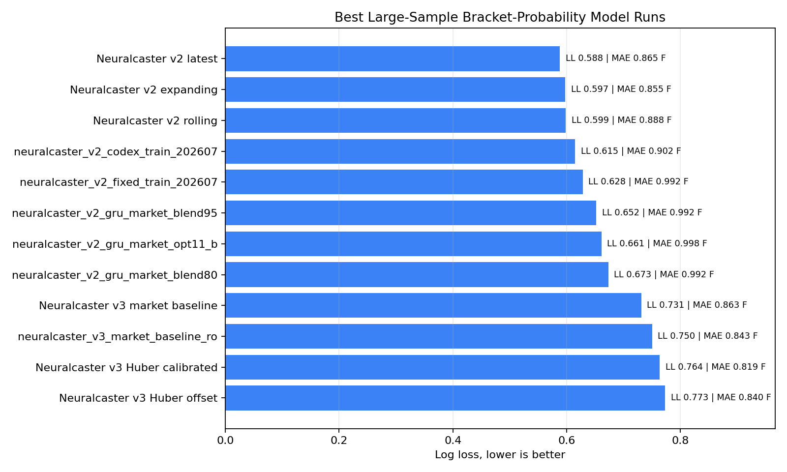

## Operational Definitions

This section defines the project terms in plain language.

**Kalshi weather market.** A prediction market contract tied to a weather outcome, such as the official high temperature in a city on a specific date. A contract pays out if its condition is true.

**City-day.** One city on one target date. For example, Miami on 2026-07-24 is one city-day. This is the natural independent unit for weather settlement.

**Bracket.** A temperature range listed by Kalshi, such as a bucket for final high temperature. A model must assign probability across all possible brackets.

**YES and NO sides.** A YES contract pays if the bracket wins. A NO contract pays if that bracket does not win.

**Settlement.** The final official result that determines which bracket won. In next-gen reports, Kalshi settlement rows remain authoritative for bracket winners, while `final_temperature_labels.final_high_f` is preferred for the final NWS maximum temperature label when available.

**Snapshot.** A point-in-time record of what was known at collection time: weather forecasts, observations, market prices, raw payload references, and provider errors. The key requirement is that a later backtest cannot substitute newer information.

**Checkpoint.** A scheduled forecast time relative to a city-day. The legacy system used five checkpoints: T-6h, T+6h, T+10h, T+14h, and T+18h, where T is the start of the fixed-standard-time climate day.

**Feature.** A piece of information given to a model. In this project, features can include the city, time of day, current NWS forecast, recent observations, ensemble forecast summaries, bracket boundaries, market price, or spread.

**Model.** A repeatable calculation that turns inputs into predictions. A simple model might average forecasts. A machine-learning model learns patterns from past examples and then applies those patterns to new examples.

**Training.** The process where a model learns from historical examples with known outcomes. For example, it can learn from old snapshots where the final high temperature is already known.

**Validation.** A practice test used while designing or choosing a model or strategy. Validation data should be separate from the data used for training, so it gives a more honest check than training performance.

**Test window.** A final held-out period used to judge a chosen model or strategy. The test window should not be used to tune the rules after seeing the result.

**In-sample.** A result measured on data that helped build or tune the model. In-sample results can look too good.

**Out-of-sample.** A result measured on data the model did not train on. Out-of-sample results are more trustworthy.

**Baseline.** A simple comparison model. Baselines answer the question: "Did the fancy model beat something basic?" In this project, baselines include NWS forecasts, ensemble medians, and market midpoint probabilities.

**Ablation.** A test where one ingredient is removed or changed to see whether it helped. For example, a weather-only ablation removes market prices from the model.

**Ensemble.** A collection of forecasts from one or more weather models. Instead of relying on one forecast, an ensemble shows a range of plausible outcomes.

**Ensemble median.** The middle forecast in an ensemble after sorting all forecast values. Half the ensemble members are hotter and half are cooler.

**Distribution.** A full range of possible outcomes and their probabilities. A weather model should not only say "93 F"; it should say how likely 91 F, 92 F, 93 F, and neighboring values are.

**Gaussian mixture.** A way to build a smooth probability distribution by combining several bell-shaped curves. In plain English, it turns many possible forecast highs into a probability curve over temperatures.

**Residual.** The leftover error after a baseline forecast. If NWS predicts 92 F and the final high is 95 F, the residual is +3 F. A residual model tries to predict that leftover adjustment.

**Offset.** An adjustment added to a baseline forecast. In this project, offset and residual are closely related terms.

**Market blend.** A prediction that combines model-generated probabilities with probabilities implied by market prices. This can improve scoring, but it means the result is not weather-only.

**Market-aware model.** A model that uses market information such as prices, midpoint, or spread. It may forecast Kalshi brackets well, but it is partly learning from the market's own opinion.

**Weather-only model.** A model that uses weather and calendar information but not Kalshi prices. This is cleaner for measuring meteorological forecasting skill.

**Rolling window.** A moving training period. For example, a 14-day rolling window trains on the last 14 days, tests the next day, then rolls forward.

**Expanding window.** A training period that grows over time. It might train on the first week, test the next day, then train on the first week plus that next day, and so on.

**Fixed window.** A training and testing setup with dates chosen in advance, such as train on 2026-07-16 through 2026-07-23 and test on 2026-07-24 through 2026-07-30.

**Temperature MAE.** Mean absolute error in degrees Fahrenheit. If a model predicts 92 F and the final high is 94 F, the absolute error is 2 F.

**RMSE.** Root mean squared error. This penalizes large misses more than MAE.

**Bias.** Average signed error. Positive bias means the model tends to predict too hot; negative bias means too cool.

**Log loss.** A probability scoring metric where lower is better. It strongly penalizes assigning low probability to the event that actually occurs. For this project, it is one of the best measures of bracket probability quality.

**Brier score.** Another probability scoring metric where lower is better. It measures squared distance between predicted probabilities and the actual outcome.

**Ranked Probability Score, or RPS.** A probability score for ordered categories, such as temperature brackets. It rewards placing probability near the true bracket, not only exactly on it.

**Top-one accuracy.** The share of forecasts where the single most likely predicted bracket was the winning bracket.

**Winner probability.** The average model probability assigned to the eventual winning bracket.

**Calibration.** The match between predicted probabilities and observed frequencies. If events predicted at 60% happen about 60% of the time, the model is well calibrated at that level.

**Reliability chart.** A chart that checks calibration. It compares predicted probability buckets, such as 40% to 50%, with how often those events actually happened.

**Expected value, or EV.** The average expected profit from a trade before uncertainty resolves. In simple terms, a contract with 60% true win probability and a 45 cent entry price has positive gross EV before fees and execution issues.

**Edge.** The model probability minus the entry price or market-implied probability, adjusted according to the report's policy. A positive edge means the model believes the contract is underpriced.

**PnL.** Profit and loss in the report's units. In these research reports it is paper backtest PnL, not live realized trading performance.

**ROI.** Return on investment, usually PnL divided by risk or stake.

**CLV.** Closing line value. This measures whether the entry price improved relative to a later price. Positive CLV can indicate that the market moved in the trade's favor after entry, even before settlement.

**Kelly sizing.** A bankroll-sizing method that scales position size with perceived edge and odds. The legacy simulator used capped fractional Kelly variants to avoid excessive exposure.

**GRU.** Gated Recurrent Unit, a kind of neural-network layer designed for sequences. In this project, a GRU can learn from a sequence of hourly snapshots instead of treating each hour as unrelated.

**Neural network.** A flexible machine-learning model made of many simple mathematical units. It can learn complicated patterns, but it can also overfit when data is limited.

**PyTorch.** A software library used to build and train neural networks.

**Huber loss.** A training rule that behaves like squared error for small misses but is less harsh on very large misses. It is often used when noisy outliers could distort the model.

**Ridge model.** A linear model with a penalty that discourages overly large weights. The penalty helps prevent overfitting.

**Elastic net.** A linear model with two kinds of penalties. It can shrink weak inputs and sometimes reduce the number of inputs the model relies on.

**MOS.** Model Output Statistics. In weather forecasting, MOS usually means a statistical correction layer that learns how to adjust raw weather model forecasts using historical errors.

**Tree model.** A machine-learning model that makes predictions through a series of if/then splits. It can capture nonlinear patterns without a neural network.

**Ranker.** A model that orders candidates from most promising to least promising instead of only estimating a raw probability. Edgecaster is described as a ranker because it tries to rank possible trades by expected reward.

**Candidate.** A possible trade or prediction option being evaluated. For example, each city/date/bracket/side combination can be a candidate trade.

**Probability floor.** A minimum probability value. A floor such as 0.001 prevents the model from saying an outcome is literally impossible, which can make scoring and risk estimates more stable.

**Sigma.** A measure of spread or uncertainty. A larger sigma means the model thinks a wider range of temperatures is plausible.

**Overfitting.** When a model learns quirks of the training data that do not repeat later. An overfit model can look excellent on old data and fail on new data.

**Regularization.** A technique for reducing overfitting by discouraging overly complicated models or overly large model weights.

**No leakage.** A research rule that training and prediction must not use future information. For this project, a model scored on a date should only use information that would have been available before or at the prediction checkpoint.

**Immutable fact database.** The next-gen idea that Supabase stores raw and normalized facts, while local reports and model outputs remain disposable and reproducible.

## How to Read the Model Names

Many report names are compact technical labels. A non-technical reader can read them as recipe cards:

| Name part | Plain-English meaning |
|---|---|
| `raycaster`, `cloudcaster`, `neuralcaster`, `edgecaster` | Internal names for different model or strategy families. The names do not matter as much as what data and method each report used. |
| `v1`, `v2`, `v3` | Version number. Higher is newer, not automatically better. |
| `weather_only` | The report avoided Kalshi market prices as model inputs. |
| `market` or `market_blend` | The report used market prices or market-implied probabilities. |
| `residual` or `offset` | The model predicted an adjustment to a simpler baseline forecast. |
| `rolling14` | The model repeatedly trained on the prior 14 days and tested the next day. |
| `fixed_train_..._test_...` | The report used one fixed training date range and one fixed testing date range. |
| `huber`, `ridge`, `tree`, `gru`, `mlp` | Different machine-learning methods. They are tools, not conclusions by themselves. |
| `calibrated_sigma` | The report adjusted the model's uncertainty spread, not just the center forecast. |
| `ev` | The report evaluated expected-value trading rules, not only weather prediction accuracy. |

## Evidence Base and Folder Coverage

The local repository is organized into two chapters:

| Chapter | Role | Evidence Used |
|---|---|---|
| `legacy-experimentation/` | Archived prototypes, collectors, weather probability models, pilot backtests, offline training, HRRR experiments, and strategy simulations. | Legacy README, collector docs, generated PNG dashboards, `summary.json`, `summary.csv`, `before_after.csv`, pilot report CSVs, strategy simulation outputs. |
| `next-gen/` | Active modular codebase for immutable exports, data quality, weather models, strategy evaluation, Trends, control plane, and deployable collector code. | Subsystem documentation, frozen export manifests, quality reports, model summaries, strategy reports, charts, and generated CSV metrics. |

I generated a complete non-vendor folder inventory at `research-paper/folder_inventory.csv`. It covers 758 folders after excluding `node_modules`, Python caches, test caches, and git internals. The largest evidence-producing areas are:

| Folder | Recursive files | Role |
|---|---:|---|
| `next-gen/reports/model` | 1,485 | Model evaluation reports, predictions, errors, charts, metrics. |
| `next-gen/reports/strategy` | 1,329 | Strategy simulations, EV backtests, Edgecaster reports, trades, daily PnL. |
| `legacy-experimentation/backtest_data/cohorts/pilot-v1` | 538 | Legacy point-in-time pilot snapshots, attempts, missing markers, settlements, reports. |
| `legacy-experimentation/output` | 335 | Legacy generated charts, model improvement reports, HRRR analysis, strategy dashboards. |
| `next-gen/data` | 77 | Frozen local exports from Supabase facts. |
| `next-gen/maxtemp-engine` | 50 | Weather model source code and versioned model families. |
| `next-gen/reports/quality` | 44 | Data quality and pipeline health artifacts. |
| `next-gen/control` | 34 | Registry-backed workbench backend and artifact control. |
| `next-gen/production` | 30 | Deployable collector and bot/server packaging. |

The paper also uses consolidated indexes generated during this review:

| Generated index | Rows | Purpose |
|---|---:|---|
| `research-paper/model_summary_index.csv` | 130 | Model metrics extracted from generated next-gen model summaries. |
| `research-paper/strategy_summary_index.csv` | 106 | Strategy metrics extracted from generated next-gen strategy summaries. |
| `research-paper/quality_summary_index.csv` | 3 | Data-quality report summaries. |
| `research-paper/dataset_summary_index.csv` | 12 | Frozen export manifests and dataset summaries. |
| `research-paper/legacy_summary_index.csv` | 25 | Legacy output summary files. |

## Research Timeline

### Phase 1: Legacy Experimentation

The legacy system began as a weather probability script for six Kalshi high-temperature series: New York City, Miami, Los Angeles, Denver, Austin, and Oklahoma City. It combined:

| Source | Role |
|---|---|
| NWS forecasts and observations | Anchored the forecast center and incorporated observed high-so-far during the active climate day. |
| Open-Meteo ensemble families | GEFS, ECMWF IFS, ICON EPS, and GEM supplied ensemble spread. |
| Kalshi bracket definitions | Defined the probability categories to be scored and eventually traded. |
| Kalshi prices | Used later in offline strategy simulation, not in the initial weather-only probability script. |
| HRRR short-range forecasts | Later tested as a short-range top-three bracket reranker. |

The first model assigned equal total weight to each weather model family, centered the ensemble distribution to NWS, and used a Gaussian mixture to convert possible final highs into bracket probabilities. In plain English, it combined many weather forecasts, shifted the center toward the official NWS forecast, then turned the range of possible temperatures into odds for each Kalshi bracket. During an in-progress climate day, already observed station temperatures acted as a floor: the model could not assign probability to a final high below the high already observed.

The legacy README correctly warned that the model was uncalibrated and that historical evaluation was required before treating the probabilities as trading estimates. That warning became one of the main research design principles.

### Phase 2: Point-in-Time Backtesting

The next lesson was that old forecasts are hard to reconstruct. Current NWS forecasts and individual Open-Meteo ensemble members do not reliably preserve the exact view available at an earlier checkpoint. The legacy backtester therefore began collecting forecasts prospectively. Every snapshot included raw API responses, retrieval time, source hash, full probability distribution, and forecast-only ablations. Missed checkpoints were marked missing instead of filled later.

This is important because a weather trading system is especially vulnerable to hidden leakage. If the model sees weather observations or revised forecasts that would not have been available at trade time, a backtest can look much better than a real strategy.

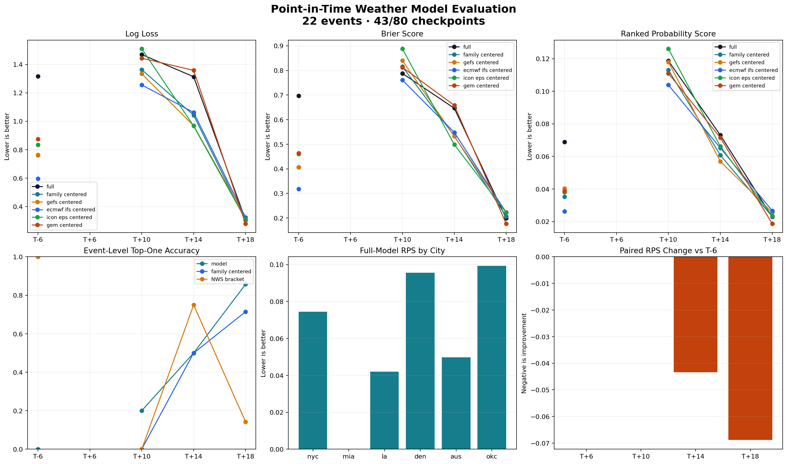

### Phase 3: Offline Calibration, HRRR, and Strategy Simulation

Legacy work then added offline calibration and strategy simulation:

| Experiment family | What it tested | What it taught |
|---|---|---|
| Offline trained blend | Whether archived forecasts could be blended into better bracket probabilities. | Calibration layers helped, but in-sample trained-on-all results were not proof of out-of-sample edge. |
| Weather-only calibration | Whether model improvement survived without Kalshi price signals. | Weather-only forecasts were useful but weaker than market-aware probabilities. |
| HRRR top-three rerank | Whether short-range HRRR highs could resolve adjacent bracket ambiguity. | HRRR helped in specific cases but was not a universal improvement. |
| Strategy simulator | Whether archived YES ask prices could support positive-EV paper trades after fees and sizing. | Trade outcomes were unstable under filter and sizing changes; longshots were especially risky. |

The model improvement report staged with HRRR showed that trained blends and market midpoint signals could score well on the small legacy set. In the `before_after.csv` sample, `checkpoint_trained_blend` reached latest-per-event log loss 0.375 and top-one accuracy 82.8% across 58 events, while `market_midpoint` reached log loss 0.623 across all forecasts and top-one accuracy 69.5%. Those numbers are useful but should be treated cautiously because the date count was small.

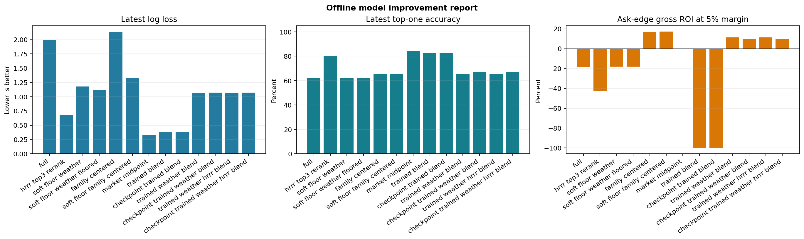

The legacy winner applied to a next-gen export showed the danger of broad policy transfer. On 2026-07-01 through 2026-07-20, the `checkpoint_trained_weather_hrrr_blend` top-one-only strategy produced 921 trades, net PnL -13.62, stake 72.62, ROI -18.8%, and hit rate 4.6%. A narrower legacy-checkpoint version made 131 trades and +5.53 PnL with 48.2% ROI, but the very low hit rate and small stake make it hard to generalize.

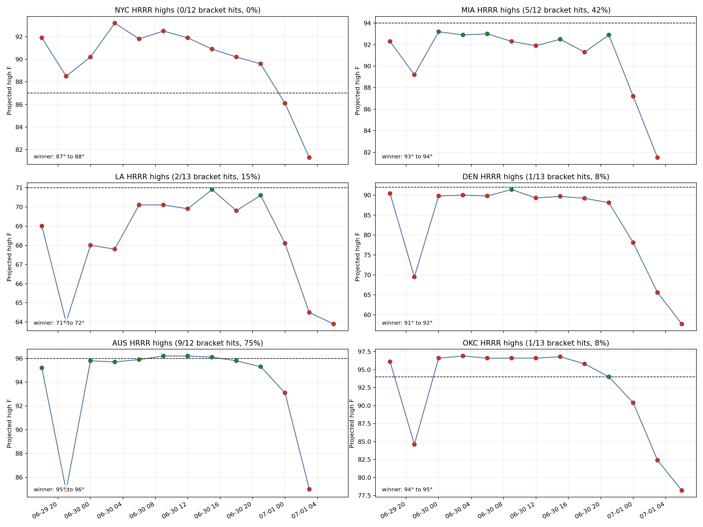

### Phase 4: Next-Gen Rebuild

The next-gen system reorganized the project around explicit boundaries:

| Subsystem | Responsibility |
|---|---|
| `libs/` | Shared clients, schemas, constants, metrics, time helpers, probability utilities, and validation helpers. |
| `backtest/` | Supabase export, validation, quality reporting, no-leakage checks, settlement loading, and generic scoring. |
| `maxtemp-engine/` | Weather-only models that predict final NWS max temperature and convert distributions into bracket probabilities. |
| `strategy/` and `strategy-engine/` | EV, fees, sizing, fills, PnL, and trade/no-trade logic. |
| `production/deployable/collector/` | Collector v3, the deployed hourly immutable fact collector. |
| `trends/` | Local GUI workbench for inspecting exports, quality, model reports, and diagnostics. |
| `control/` | Registry-driven workbench backend for discoverable exports, model runs, jobs, artifacts, and visualization contracts. |

The most important architectural change is the separation between facts and reports. Supabase stores immutable facts. Local report folders store experiments, summaries, charts, predictions, and model outputs. Reports are disposable and reproducible; facts are not.

## Data Collection and Quality

The next-gen daily operating loop is:

1. Collector v3 runs hourly and writes immutable facts to Supabase/Postgres and raw payload references to storage.
2. Local development exports a date range into `next-gen/data/`.
3. Validation and quality reports check coverage and consistency.
4. Models train and score against frozen exports.
5. Trends or the control plane inspect the exact export and report folders.

The generated quality reports show strong coverage:

| Quality report | Actual city-hours | Expected city-hours | Coverage | Provider errors | Pending settlements |
|---|---:|---:|---:|---:|---:|
| `pipeline_20260622_20260721_20260722T192955Z` | 2,856 | 2,856 | 100.0% | 85 | 0 |
| `pipeline_20260622_20260722_20260723T140150Z` | 3,000 | 3,000 | 100.0% | 85 | 0 |
| `codex_latest_20260702_20260730_quality` | 4,148 | 4,152 | 99.9% | 103 | 6 |

The 2026-06-22 to 2026-07-22 pipeline report contained:

| Table | Rows |
|---|---:|
| `collector_runs` | 1,503 |
| `events` | 3,000 |
| `weather_snapshots` | 3,000 |
| `market_snapshots` | 18,000 |
| `raw_payloads` | 26,895 |
| `provider_errors` | 85 |
| `settlements` | 132 |
| `final_temperature_labels` | 132 |

The latest quality summary had 4 missing city-hours out of 4,152 expected and 6 pending settlements. That is a good operational result, but the pending settlements matter: strategy and model metrics should distinguish fully settled periods from partially pending periods.

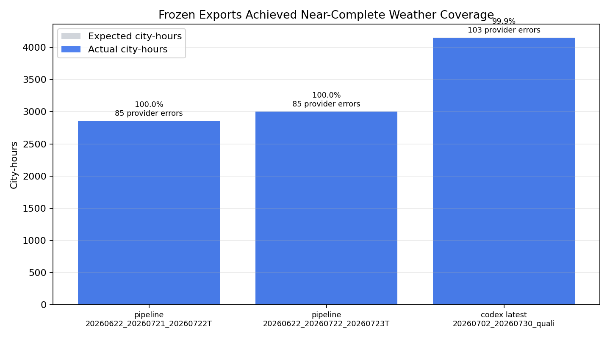

## Weather Modeling Results

### Raycaster v1

Raycaster was the first serious next-gen model family for final NWS high prediction. It evaluated multiple baselines and model variants, including NWS anchor, HRRR projected, NBM projected, ensemble median, source blend, MOS ridge, MOS elastic net, and Raycaster. The important reader-friendly point is that Raycaster was compared against simpler reference methods, not judged in isolation.

In `raycaster_v1_benchmark_corrected_20260713T_exec`, the report compared 1,597 bracket rows:

| Model | MAE | Log loss | Brier | RPS | Top-one accuracy | Winner probability |
|---|---:|---:|---:|---:|---:|---:|
| Raycaster | 1.171 | 1.094 | 0.583 | 0.081 | 55.3% | 38.3% |
| Source blend | 1.204 | 1.078 | 0.560 | 0.078 | 57.9% | 45.1% |
| MOS ridge | 1.216 | 1.084 | 0.554 | 0.079 | 57.8% | 45.2% |
| NWS anchor | 1.339 | 1.145 | 0.597 | 0.085 | 52.2% | 43.0% |
| Ensemble median | 1.450 | 1.238 | 0.630 | 0.096 | 50.3% | 41.6% |

Raycaster improved point-temperature accuracy relative to simple baselines, but source blend and MOS models could score better on probability metrics. This was an early sign that final temperature MAE and bracket probability quality are related but not identical objectives.

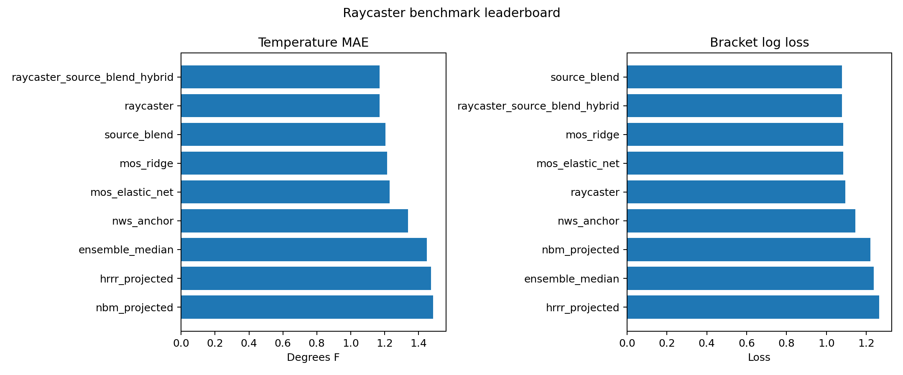

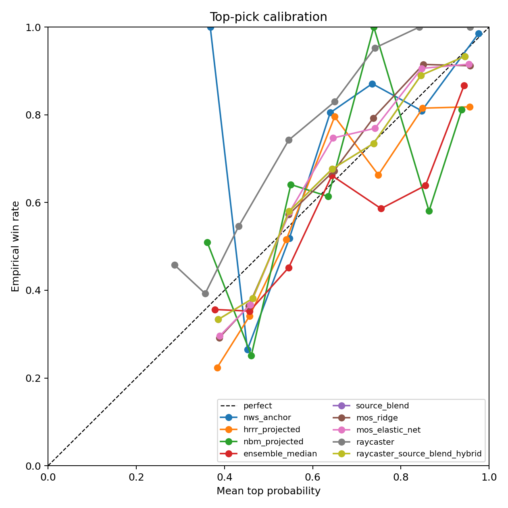

### Cloudcaster v1

Cloudcaster experiments tested weather-only and ablation-style strategies. The generated model reports had checkpoint MAE and bracket-accuracy charts, while strategy reports tested policy choices. A notable result was `cloudcaster_v1_ablation_weather_only_20260713T202852`, which produced 42 trades, +245.19 PnL, 102.2% ROI, and 40.5% hit rate.

That result is encouraging but not conclusive. A related residual variant, `cloudcaster_v1_ablation_city_residual_20260713T202852`, produced 41 trades, -58.22 PnL, -27.1% ROI, and 26.8% hit rate. The contrast shows that early profitable results can depend on a narrow combination of model, dates, and filters.

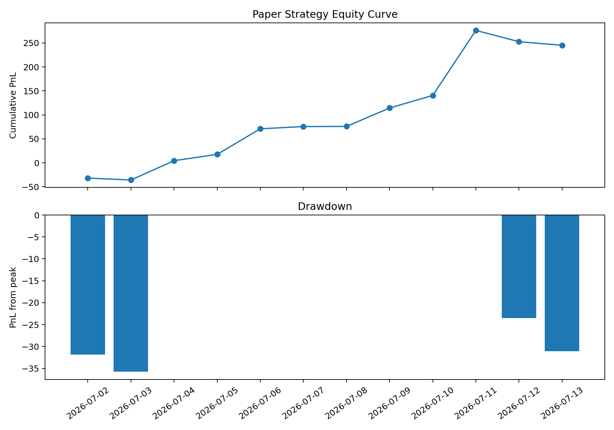

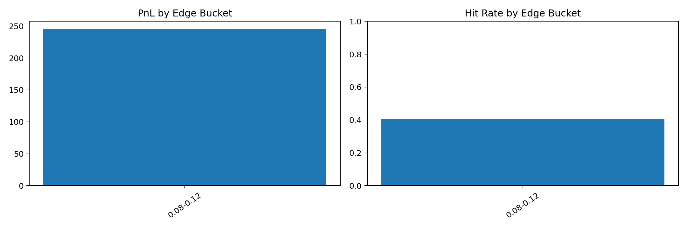

### Neuralcaster v2

Neuralcaster v2 became the best large-sample bracket probability performer in the generated report index. It used a PyTorch GRU-style residual architecture with rolling or expanding windows and, in the best reports, a heavy market probability blend. In ordinary language, this means it used a neural network to learn from sequences of recent snapshots, repeatedly retrained on recent days, and mixed its forecast with the market's current opinion. The strongest large-sample rows were:

| Report | Rows | MAE | Log loss | Top-one accuracy | Winner probability |
|---|---:|---:|---:|---:|---:|
| `neuralcaster_v2_latest_20260702_20260729_market_rolling14_blend95` | 2,012 | 0.865 | 0.588 | 75.1% | 63.7% |
| `neuralcaster_v2_ev_20260702_20260730_market_expanding14_blend95_20260731` | 2,119 | 0.855 | 0.597 | 74.1% | 63.2% |
| `neuralcaster_v2_ev_20260702_20260730_market_rolling14_blend95` | 2,119 | 0.888 | 0.599 | 74.1% | 63.1% |
| `neuralcaster_v2_codex_train_20260701_20260708_score_20260709_20260720` | 1,691 | 0.902 | 0.615 | 72.7% | 62.9% |

The v2 results are the current strongest evidence that market-aware probability modeling can materially improve bracket forecasts. The caveat is built into the phrase "market-aware": these models are not pure weather models. They partially learn from market prices, so they should be evaluated as market-relative forecasting or strategy inputs.

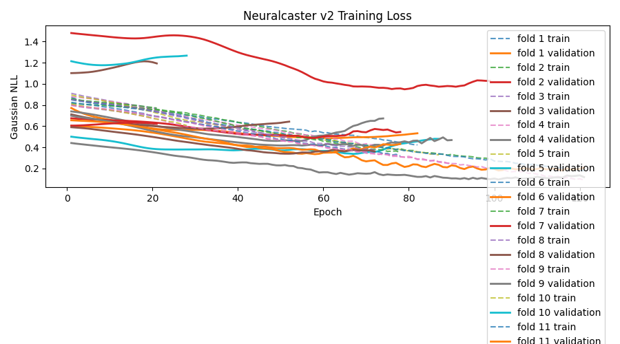

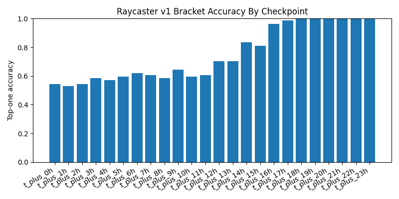

### Neuralcaster v3

Neuralcaster v3 explored NWS residual distributions with model kinds such as GRU residual, Huber residual, ridge offset, source blend, tree offset, and market baseline variants. These are different ways of predicting the correction from a simpler forecast to the final high temperature. The v3 work is valuable because it clarifies the difference between point-temperature improvements and bracket-probability improvements.

Selected v3 results:

| Report | Rows | MAE | Log loss | Top-one accuracy | Interpretation |
|---|---:|---:|---:|---:|---|
| `neuralcaster_v3_huber_market_delta_calibrated_sigma_rolling14_test1` | 2,012 | 0.819 | 0.764 | 71.3% | Strong point-temperature accuracy, weaker bracket log loss than v2. |
| `neuralcaster_v3_market_baseline_20260702_20260730_rolling14_test1` | 2,118 | 0.863 | 0.731 | 71.1% | Better bracket probabilities than many v3 variants, still behind v2. |
| `neuralcaster_v3_huber_offset_20260702_20260730_rolling14_test1` | 2,118 | 0.840 | 0.773 | 70.3% | Competitive MAE, not top bracket scoring. |
| `neuralcaster_v3_gru_offset_20260702_20260730_rolling14_test1` | 2,118 | 1.251 | 1.379 | 39.9% | Poor bracket probability result despite improving over NWS baseline MAE in residual terms. |

The v3 GRU offset report is a useful negative result. It reported NWS baseline MAE 3.093 F, model temperature MAE 1.251 F, and MAE improvement 1.841 F, but bracket log loss was 1.379 and top-one accuracy only 39.9%. This means the model learned something about temperature residuals but did not transform that knowledge into useful bracket probabilities.

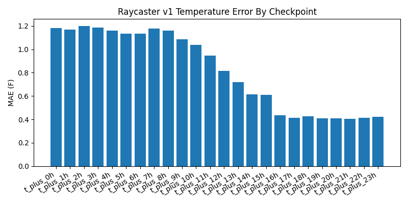

### Cross-Model Comparison

The best current model hierarchy depends on the target:

| Objective | Current evidence |
|---|---|
| Best bracket log loss | Neuralcaster v2 market-blended rolling/expanding runs. |
| Best point-temperature MAE among sampled large runs | Neuralcaster v3 Huber market-delta calibrated or related Huber variants. |
| Best weather-only interpretability | Raycaster and v3 residual families are clearer than market-blended v2. |
| Best pure deployment candidate | Not yet established; requires longer settled periods and pre-registered strategy policy. |

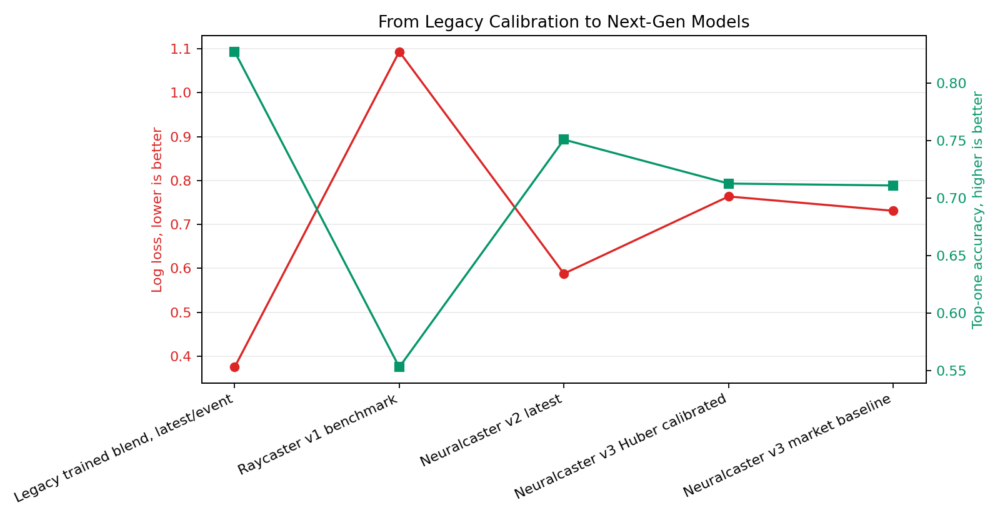

## Strategy and Trading Results

The project has correctly treated strategy research as separate from weather modeling. This matters because a good forecast can still be a bad trade if:

| Failure mode | Example |
|---|---|
| The market already prices the forecast. | A strong weather signal has little EV if the ask price is already high. |
| The model is miscalibrated. | A 70% predicted bracket that wins only 50% of the time loses money at many prices. |
| The wrong side is selected. | NO trades can look attractive when a model overstates certainty that a bracket is dead. |
| Fees and spreads consume the edge. | Small theoretical EV can disappear after execution costs. |
| Sample size is too small. | A few longshot wins can dominate ROI over a short window. |

### Legacy Strategy Lessons

Legacy strategy simulations made several important discoveries:

| Legacy result | Lesson |
|---|---|
| Broad legacy winner on next-gen export: 921 trades, -13.62 PnL, -18.8% ROI. | A profitable-looking legacy configuration did not broadly transfer to later normalized exports. |
| Legacy-checkpoint-only variant: 131 trades, +5.53 PnL, 48.2% ROI. | Narrow filters can improve results, but small stake and low hit-rate dynamics limit confidence. |
| Kelly and longshot-cap variants. | Sizing rules can reduce exposure but also change the research question. |
| HRRR top-three rerank. | Short-range forecasts can resolve some neighboring brackets but should not create new trades outside the original plausible set without validation. |

### Edgecaster

Edgecaster was designed to move beyond raw model probability by learning candidate trade rewards. Instead of asking only "which bracket is likely?", Edgecaster asks "which possible trade looks most rewarding after price and risk are considered?" The reports show mixed results and one clear failure mode.

In the 2026-07-15 to 2026-07-16 opportunity analysis, Edgecaster's trained reward model compressed every test prediction below zero:

| Diagnostic | Value |
|---|---:|
| Test candidate side/contracts | 2,591 |
| Candidates passing execution gates | 1,220 |
| Edgecaster positive predicted rewards | 0 |
| Edgecaster max predicted reward | -0.009251 |
| Edgecaster candidates passing default reward gate | 0 |

The same opportunity analysis found that raw Neuralcaster edge had profitable tiny pockets but broad edge was not profitable. A high raw-edge filter at 0.40 produced 3 trades, +8.84 PnL, and 66.7% hit rate. That is too few trades to trust, but it shows that the reward model missed potentially useful high-conviction signals.

The analysis also identified a false-certainty problem: an observed-floor adjustment could force bounded bracket YES probability to 0 after an observed high exceeded a bracket upper bound, creating huge NO edges. In at least one OKC case, this created a false positive because observed-high-so-far and final settlement did not agree as the feature logic expected. The operational lesson is that feature-derived certainty must be audited against settlement rules.

Edgecaster v2 latest calibrated reports were conservative. One report produced 8,948 prediction examples and 0 trades. That is safer than forcing bad trades, but it does not yet solve the trade selection problem.

### Neuralcaster EV Strategy

The most relevant current strategy evidence comes from Neuralcaster EV validation reports using fixed train/test windows and explicit execution constraints.

Selected strategy results:

| Strategy report | Test window | Trades | PnL | ROI | Hit rate | Notes |
|---|---|---:|---:|---:|---:|---|
| `neuralcaster_ev_validation_train_20260716_20260722_test_20260723_20260729` | 2026-07-23 to 2026-07-29 | 28 | +29.06 | 36.8% | 50.0% | Strong short-window validation-style result. |
| `neuralcaster_v3_huber_market_delta_ev_validation_train_20260716_20260722_test_20260723_20260729` | 2026-07-23 to 2026-07-29 | 37 | +18.73 | 18.1% | 51.4% | Positive with YES-only validation choice. |
| `neuralcaster_v2_ev_train_20260716_20260723_test_20260724_20260730` | 2026-07-24 to 2026-07-30 | 42 | +8.70 | 7.5% | 52.4% | Positive but weaker than validation window. |
| `neuralcaster_ev_latest_20260723_20260729_min_ev_003_price_02_80` | 2026-07-23 to 2026-07-29 | 59 | -28.40 | -25.7% | 18.6% | Loose filter negative control. |
| `neuralcaster_v3_tree_offset_ev_validation_train_20260716_20260722_test_20260723_20260729` | 2026-07-23 to 2026-07-29 | 27 | -30.37 | -39.3% | 18.5% | Model family negative result. |

The v2 EV report selected validation parameters with 48 validation trades, +24.50 validation PnL, 18.2% validation ROI, and 50.0% hit rate. On the later test window it produced 42 trades, +8.70 PnL, 7.5% ROI, 52.4% hit rate, average edge 3.0 percentage points, and max drawdown -17.51.

The v3 Huber market-delta report selected a YES-only validation policy with 37 validation trades, +23.87 validation PnL, 23.1% ROI, average model probability 60.0%, average edge 15.6 percentage points, and 54.1% hit rate. Its test window produced 37 trades, +18.73 PnL, 18.1% ROI, average edge 15.7 percentage points, max drawdown -8.60, and 51.4% hit rate.

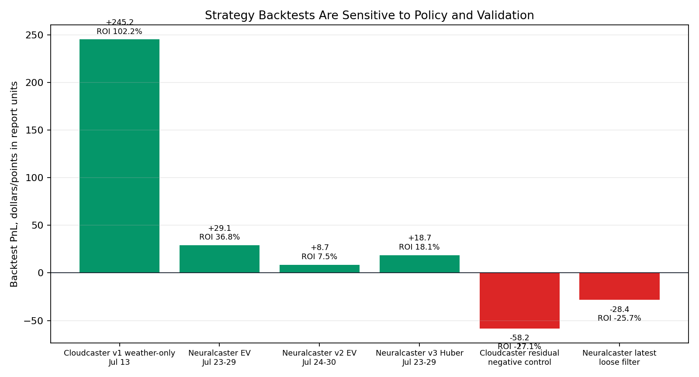

The evidence supports a cautious conclusion: constrained EV policies can find positive paper-trading windows, but the result is not robust enough for deployment. The next research step should be pre-registered rolling evaluation over a longer settled period, not further tuning on the same short windows.

## What We Have Learned

### 1. Point-in-Time Data Is Non-Negotiable

The project started by using live weather APIs, but serious evaluation required prospective archiving. The reason is simple: a model can only be judged against what it could have known at the time. The legacy collector, then the next-gen collector v3, solved this by preserving snapshots and raw payload references.

### 2. Weather Forecasting Is Not the Same as Market Forecasting

A weather-only model predicts the final high temperature. A market-aware model predicts or calibrates bracket probabilities using market prices. A strategy model decides whether a specific YES or NO contract is worth buying. These are different tasks. The next-gen folder structure now encodes that distinction.

### 3. Probability Quality Is the Main Model Target

Temperature MAE is easy to understand, but Kalshi trading depends on bracket probabilities. A model can be within 1 F often and still assign too much probability to the wrong side of a bracket boundary. Log loss, Brier score, RPS, top-one accuracy, and winner probability together provide a better view.

### 4. Market Prices Are a Strong Signal

The best large-sample next-gen model rows are market-blended Neuralcaster v2 runs. This does not mean the market can be beaten. It means the market carries information, and blending it into probabilities improves bracket scoring. The hard question is whether the model can identify cases where the market price is wrong enough to overcome spreads, fees, and selection bias.

### 5. The Best Strategy Is Not the Best Model by Default

The top model leaderboard is dominated by Neuralcaster v2 probability reports, but the strategy table includes positive and negative results across Cloudcaster, Neuralcaster, and Edgecaster variants. Good probability metrics are necessary but not sufficient. Execution filters, side selection, price bands, and budget caps decide which model predictions become trades.

### 6. Negative Results Are Valuable

The repository contains useful failures:

| Negative result | Value |
|---|---|
| Legacy broad policy losing on next-gen export. | Prevents overtrusting the old calibrated winner. |
| Cloudcaster residual negative control. | Shows early positive Cloudcaster results were not automatic. |
| Edgecaster reward collapse. | Identifies a model-target failure rather than blaming execution gates. |
| Neuralcaster loose filter losses. | Shows that more trades are not necessarily better. |
| V3 GRU offset poor bracket log loss. | Shows point residual learning does not guarantee probability quality. |

### 7. Operational Tooling Is Becoming a Research Advantage

The control plane and Trends workbench are not just UI conveniences. They make exports, reports, artifacts, and visualization contracts discoverable. That reduces manual file confusion and makes it easier to compare exact report folders without overwriting past results.

## Caveats and Limits

The current evidence has several limitations.

**Short seasonal window.** Most reports cover June and July 2026, often with focused tests inside July. Weather behavior, market behavior, and model performance may differ in other seasons.

**Limited independent city-days.** Many reports have thousands of snapshot rows but far fewer independent city-days. Multiple checkpoints for the same city-day are correlated. Reports that count snapshot rows should not be mistaken for thousands of independent settlements.

**Market-aware models are not weather-only.** Neuralcaster v2 market-blended performance is excellent for bracket scoring, but it uses market information. It should not be presented as pure meteorological forecasting skill.

**Strategy backtests are paper-only.** They may include archived ask prices, spreads, fees, budgets, and caps depending on the report, but they are not live fills. Live execution can differ because of liquidity, timing, order priority, outages, and changing market behavior.

**Policy search risk.** Many strategy folders exist. When many configurations are tried, some will look good by chance. The next step must emphasize pre-registered policies and rolling evaluation.

**Settlement and feature edge cases.** The observed-floor false-positive example shows that settlement rule details can break seemingly obvious feature logic. Any production strategy would need settlement-rule audits per city and bracket type.

**Dirty worktree context.** The repository currently contains many modified, deleted, and untracked files under `next-gen`. This paper added a new `research-paper/` artifact and did not attempt to clean or revert unrelated worktree state.

## Recommendations

### Near-Term Research

Use Neuralcaster v2 market-blended runs as the current probability benchmark, but label them clearly as market-aware. Use Neuralcaster v3 Huber and Raycaster-style reports to continue weather-only modeling research. Report both temperature MAE and bracket log loss for every model.

Pre-register the next EV policy before running it on new dates. The policy should specify model report, training window, test window, side mode, min EV, spread cap, entry price range, budget, max order cost, max contracts, and max positions per event. Results should be reported even if negative.

Keep quality gating mandatory. A model or strategy run should record the exact export ID, quality report, pending settlement count, and missing city-hours count.

### Medium-Term Research

Build a rolling evaluation table that treats city-days as the independent unit. Snapshot-level metrics are useful, but final conclusions should summarize by target date and city.

Improve Edgecaster by changing the target or calibration procedure before adding complexity. The current failure was not lack of model capacity; it was that the trained reward model compressed predictions below the trade threshold.

Audit all observed-floor and bracket-boundary features against settlement rules. Any feature that can force probability to zero deserves special tests.

Create a standard model card for each report family: data window, training regime, market features allowed or forbidden, independent city-days, snapshot rows, metrics, known caveats, and intended use.

### Deployment Readiness Criteria

No strategy should be considered deployment-ready until it passes all of the following:

| Criterion | Required evidence |
|---|---|
| Pre-registered policy | The exact strategy was declared before the test window. |
| Longer settled period | Results hold across substantially more city-days than the current short windows. |
| Quality-gated data | Missing city-hours, pending settlements, and provider errors are documented. |
| Market realism | Fees, spreads, liquidity, and available size are included. |
| Calibration stability | Predicted probability buckets match observed win rates. |
| Drawdown control | Max drawdown and daily exposure remain acceptable under losing streaks. |
| Feature audit | Bracket-boundary and settlement-rule edge cases are tested. |
| Live shadow mode | The strategy can run without placing orders and compare intended trades with actual market availability. |

## Conclusion

The project has made substantial progress. The legacy chapter established the core research problems: collect point-in-time data, evaluate bracket probabilities, calibrate models offline, test short-range HRRR signals, and simulate trades with archived prices. It also showed that early apparent edge can evaporate under broader testing.

The next-gen chapter turned those lessons into a better research system. Collector v3, frozen exports, quality reports, modular model families, separate strategy evaluation, Trends, and the control plane now provide a defensible foundation for continued work.

The strongest current modeling result is Neuralcaster v2 market-blended probability forecasting. The strongest current caution is that profitable-looking strategies are sensitive to policy and sample window. The next milestone is not another isolated best backtest. It is a pre-registered, quality-gated, rolling evaluation that can survive new settled dates without changing the rules.

## Appendix A: Major Folder Findings

| Folder family | Finding |
|---|---|
| `legacy-experimentation/backtest_data` | Preserves the pilot-v1 point-in-time backtest cohort, including attempts, missing checkpoints, snapshots, settlements, and generated reports. This is where the project learned that prospective capture is required. |
| `legacy-experimentation/output` | Contains the legacy experimental evidence: evaluation dashboards, HRRR studies, offline trained model reports, model improvement reports, and strategy simulation dashboards. These are valuable historical artifacts but not the active architecture. |
| `legacy-experimentation/demo_server_bot` | Archived demo bot code and service config. Useful as history, not as current deployment guidance. |
| `legacy-experimentation/systemd` | Early service/timer files for collection automation. Superseded by next-gen deployable collector patterns. |
| `next-gen/data` | Frozen local exports from Supabase. These are the reproducible data inputs for model and strategy reports. |
| `next-gen/backtest` | Active export, validation, quality, settlement, split, scoring, and report-writing layer. This is the methodological core for no-leakage evaluation. |
| `next-gen/libs` | Shared clients, constants, schemas, IDs, metrics, probabilities, errors, and source-family utilities. |
| `next-gen/maxtemp-engine` | Weather model source. Contains Raycaster, Cloudcaster, Neuralcaster, and template families. It should not contain trading decisions. |
| `next-gen/reports/model` | Generated model reports. This is the main evidence source for MAE, RMSE, bias, log loss, Brier, RPS, top-one accuracy, calibration, and checkpoint charts. |
| `next-gen/reports/strategy` | Generated strategy reports. This is the main evidence source for trades, PnL, ROI, hit rate, CLV, drawdown, policy sweeps, and Edgecaster diagnostics. |
| `next-gen/reports/quality` | Generated quality reports. This is the evidence source for city-hour coverage, provider errors, pending settlements, and table counts. |
| `next-gen/production/deployable` | Server-ready collector, bot, Kalshi client, systemd files, and deployment runbooks. Production code is separated from local reports. |
| `next-gen/trends` | Local analysis GUI and API for browsing exports, reports, and diagnostics. |
| `next-gen/control` | Registry-driven workbench backend for exports, model runs, jobs, artifacts, datasets, and visualization query contracts. |
| `next-gen/control-center` | Frontend implementation for the control/workbench experience. |
| `next-gen/models` | Local trained model artifacts such as Raycaster model manifests, schemas, and joblib files. |

The complete inventory is in `research-paper/folder_inventory.csv`.

## Appendix B: Figure and Table Sources

| Figure or table | Source |
|---|---|
| Model log-loss leaderboard | Generated from `research-paper/model_summary_index.csv`. |
| Legacy-to-next-gen model comparison | Generated from legacy `before_after.csv` values and `research-paper/model_summary_index.csv`. |
| Strategy PnL comparison | Generated from `research-paper/strategy_summary_index.csv`. |
| Data-quality coverage | Generated from `research-paper/quality_summary_index.csv`. |
| Legacy evaluation dashboard | Copied from `legacy-experimentation/output/evaluation_latest.json/evaluation_dashboard.png`. |
| Legacy model improvement comparison | Copied from `legacy-experimentation/output/model_improvement_report_staged_hrrr_quick/comparison.png`. |
| Legacy HRRR projected highs | Copied from `legacy-experimentation/output/hrrr_jun30_research/hrrr_projected_highs_by_city.png`. |
| Raycaster model leaderboard | Copied from `next-gen/reports/model/raycaster_v1_benchmark_corrected_20260713T_hybrid/charts/model_leaderboard.png`. |
| Raycaster calibration reliability | Copied from `next-gen/reports/model/raycaster_v1_benchmark_corrected_20260713T_hybrid/charts/calibration_reliability.png`. |
| Neuralcaster v2 training loss and bracket accuracy | Copied from `next-gen/reports/model/neuralcaster_v2_latest_20260702_20260729_market_rolling14_blend95/charts/`. |
| Neuralcaster v3 Huber MAE | Copied from `next-gen/reports/model/neuralcaster_v3_huber_market_delta_calibrated_sigma_rolling14_test1/charts/temperature_mae_by_checkpoint.png`. |
| Cloudcaster equity and edge charts | Copied from `next-gen/reports/strategy/cloudcaster_v1_ablation_weather_only_20260713T202852/charts/`. |
